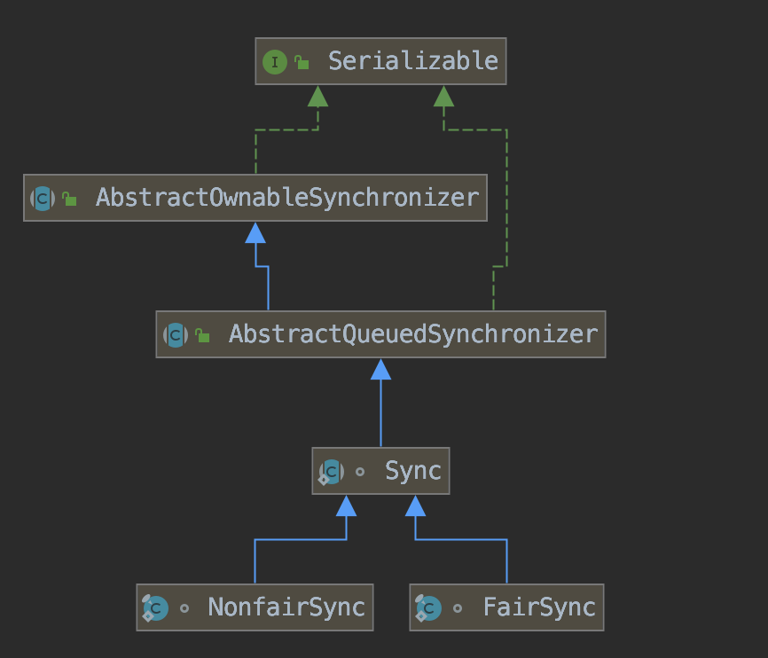

在锁机制中抢到资源的线程直接处理业务逻辑，抢不到资源的线程必然涉及一种排队等候机制，以及线程的阻塞/唤醒机制来保证所锁分配。  

涉及到排队等待就一定有一种队列数据结构，这是一个什么样的数据结构？   
如果共享资源被占用，就要涉及线程的阻塞/唤醒机制来保证所锁分配。    
AQS体系架构     
Lock接口的实现类，基本内部都聚合了一个队列同步器（AQS)的子类来完成线程访问控制。AQS主要采用CLH队列的变体来实现，将获取不到锁的线程加入队列。
将请求资源的线程封装成Node，通过CAS、自旋以及LockSupport的方式，维护state变量的状态，使并发达到同步控制的效果。

从ReentrantLock开始

```
ReentrantLock使用示意（仅主要调用，代码未完整展示）
private Lock lock = new ReentrantLock();
lock.lock();
try {
    System.out.println(Thread.currentThread().getName() + "获得锁");
} catch (Exception e) {
} finally {
    lock.unlock();
}
```
ReentrantLock支持公平锁和非公平锁（默认是非公平锁）本文先介绍非公平锁，最后简单介绍公平锁。    
是否公平锁可以通过构造器指定，源码如下：
```
    public ReentrantLock() {
        sync = new NonfairSync();
    }

    public ReentrantLock(boolean fair) {
        sync = fair ? new FairSync() : new NonfairSync();
    }
```
可以看到内部通过FairSync和NonfairSync来区分是否公平，他们都是Sync的子类，Sync继承自AbstractQueuedSynchronizer就是本文核心内容AQS。   
具体类继承关系参见下图：    


AQS主要成员变量   
head和tail都是懒加载的，当发生线程排队是才初始化。   
state默认为0，用于控制共享资源的状态。  
```
    private transient volatile Node head;   
    
    private transient volatile Node tail;
    
    private volatile int state;
```
ReentrantLock加锁流程   
```
当程序执行 lock.lock();
ReentrantLock内部调用NonfairSync的lock方法
    public void lock() {
        sync.lock();
    }
    
    final void lock() {
        // CAS设置state变量为1
        if (compareAndSetState(0, 1))
            // 如果设置成功（当前资源空闲）则设置当前资源使用的线程为当前线程，加锁成功
            // 独占与可重入的原理
            setExclusiveOwnerThread(Thread.currentThread());
        else
            // 如果设置失败（获取资源失败，当前资源已被占用）
            // 尝试获取锁，获取不到排队
            acquire(1);
    }
```
acquire尝试获取锁流程  
``` 
public final void acquire(int arg) {
    // 尝试获取锁
    if (!tryAcquire(arg) &&
        acquireQueued(addWaiter(Node.EXCLUSIVE), arg))
        selfInterrupt();
}
```